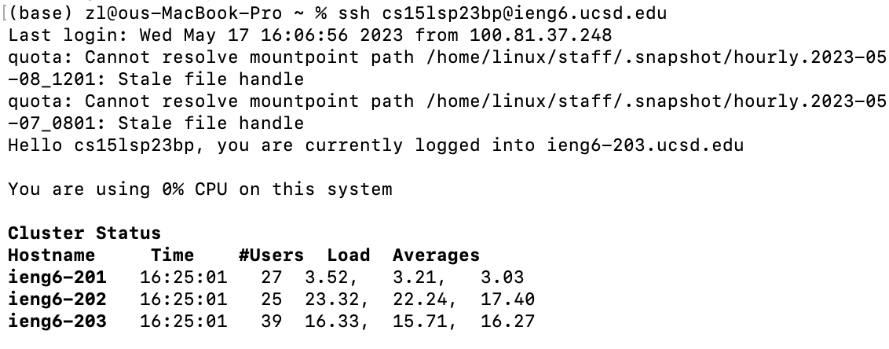
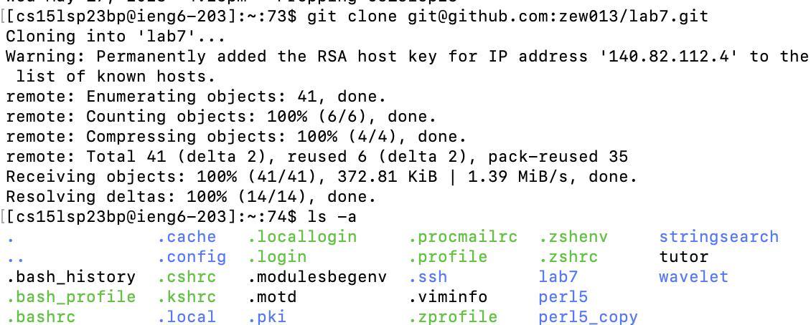
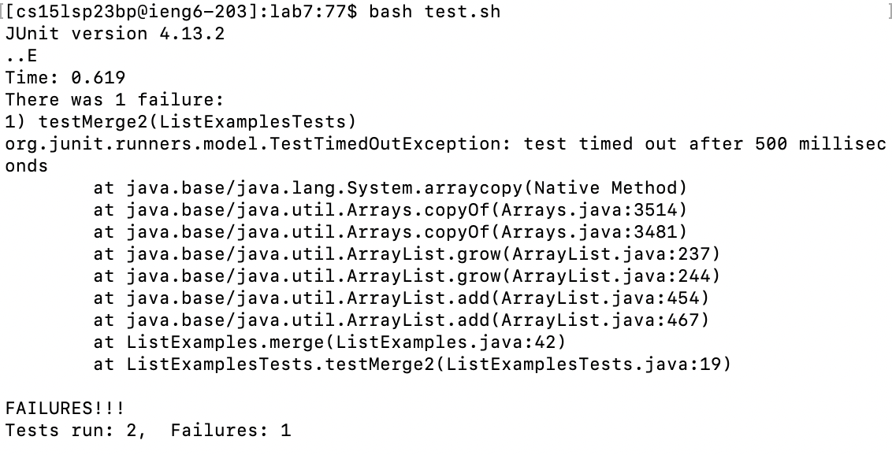
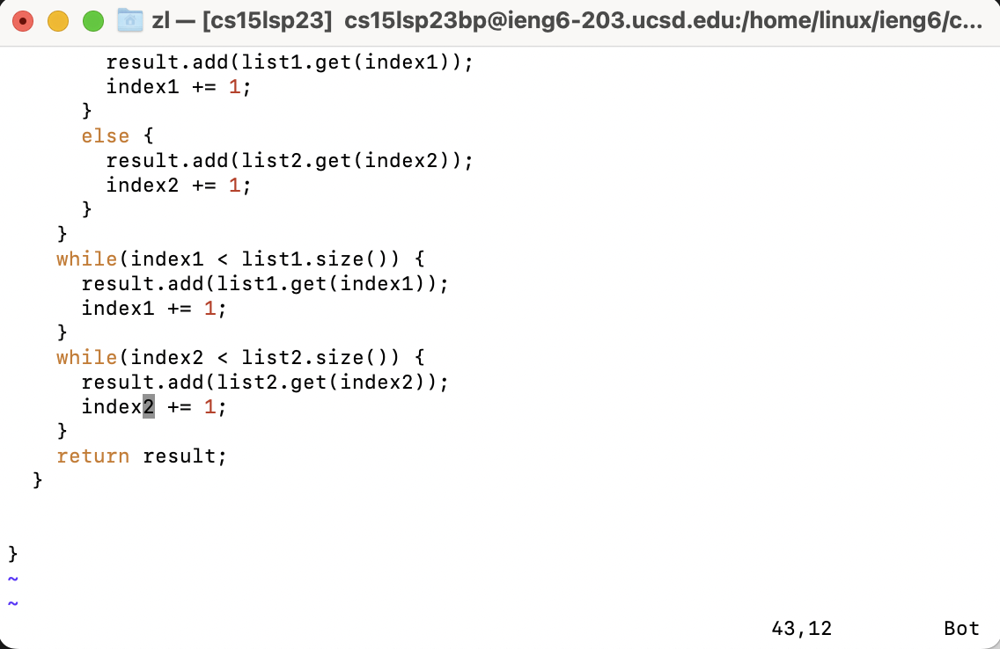
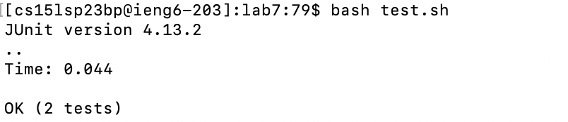
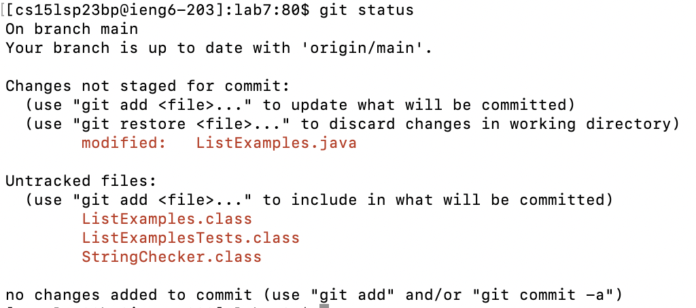
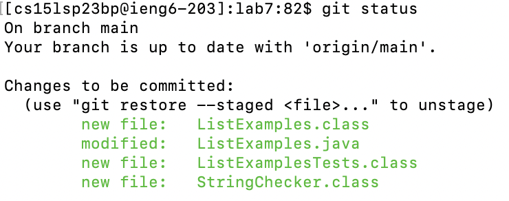
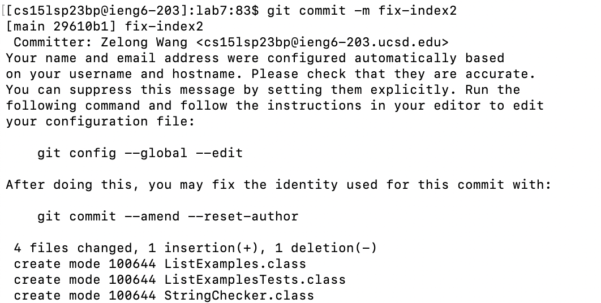
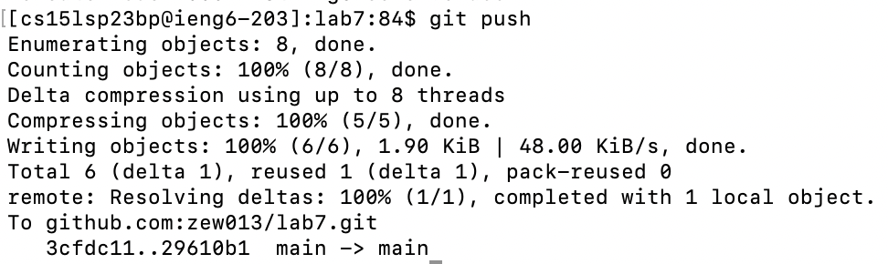

# Lab Report 4
## Zelong Wang

### Step 4: Log into ieng6

`(base) zl@ous-MacBook-Pro ~ % ssh cs15lsp23bp@ieng6.ucsd.edu` 

First as we did in Lab Report 1, we ssh into the remote server. 

### Step 5: Clone your fork of the repository from your Github account

`[cs15lsp23bp@ieng6-203]:~:73$ git clone git@github.com:zew013/lab7.git` 

Then clone the repository I forked by its ssh key. 

### Step 6: Run the tests, demonstrating that they fail

`[cs15lsp23bp@ieng6-203]:lab7:77$ bash test.sh`

Since the code to compile and run the junit test is already written in `test.sh`, we can just run the shell.

### Step 7: Edit the code file to fix the failing test

`[cs15lsp23bp@ieng6-203]:lab7:78$ vim ListExamples.java`

Open the file in vim, and edit the file by the following keys.

Keys pressed: `\index1<enter>nnnnnnnnexi2<esc>:wq`

I know the error appears at `"index1"`, so I search all appearance of it by `\index1` and hit `enter`. Then by pressing `n`, I move to the next appearance. Then by `e`, I move to the end of that word (`"1"` in `"index1"`), and hit `x` to delete `"1"` and enter the insert mode by `i`. After that, correct it with `"2"`. Hit `<esc>` to exit the normal mode. Finally, save the file and exit with `:wq`

### Step 8: Run the tests, demonstrating that they now succeed

`[cs15lsp23bp@ieng6-203]:lab7:79$ bash test.sh`

Rerun the test shell and indeed it succeed.

### Step 9: Commit and push the resulting change to your Github account (you can pick any commit message!)

`[cs15lsp23bp@ieng6-203]:lab7:80$ git status`

Check the current status.

`[cs15lsp23bp@ieng6-203]:lab7:81$ git add .`

Update the untracked files.

`[cs15lsp23bp@ieng6-203]:lab7:80$ git status`

Check the current status again.

`[cs15lsp23bp@ieng6-203]:lab7:83$ git commit -m fix-index2`

Commit the changes and name it.

`[cs15lsp23bp@ieng6-203]:lab7:84$ git push`

Push to Github

