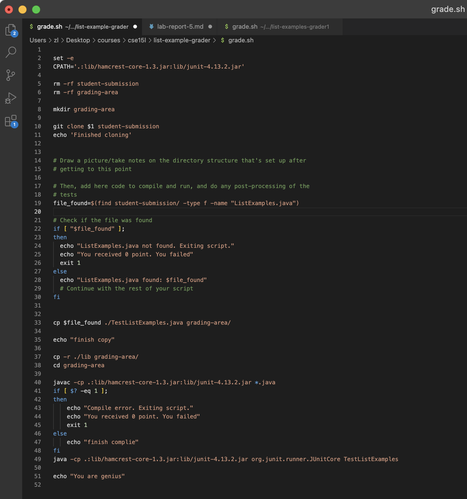
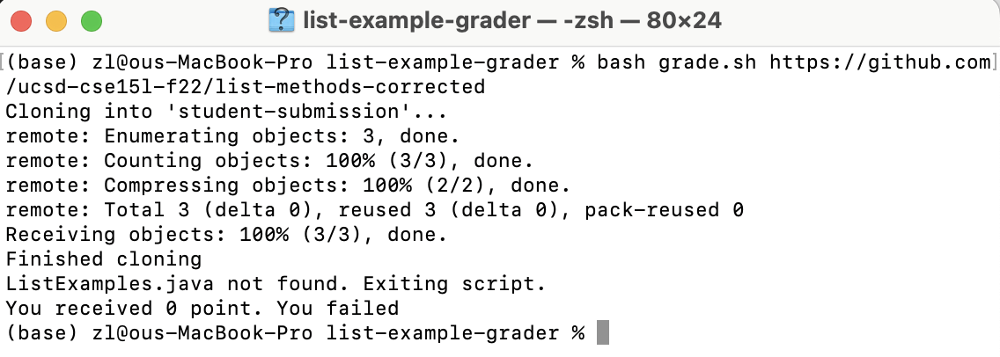
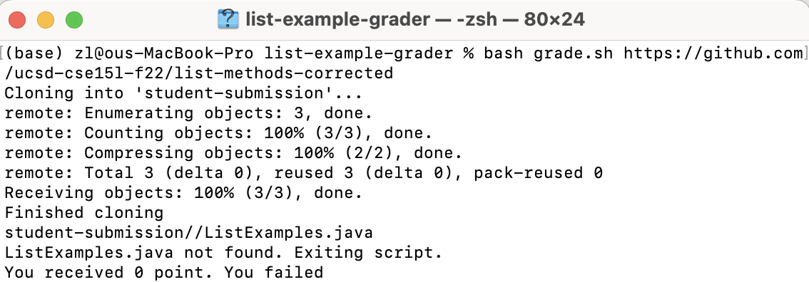
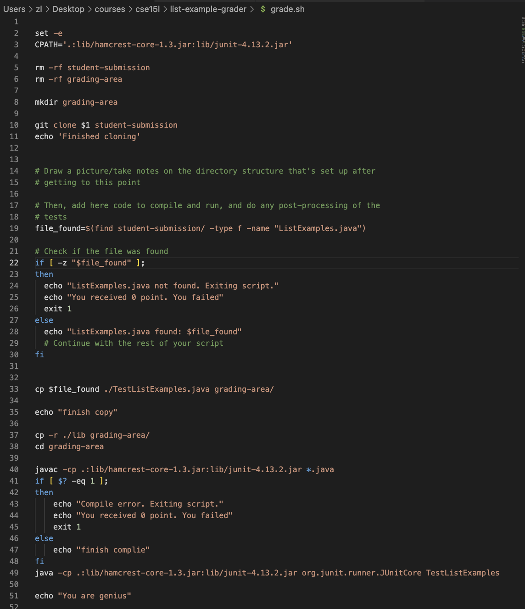
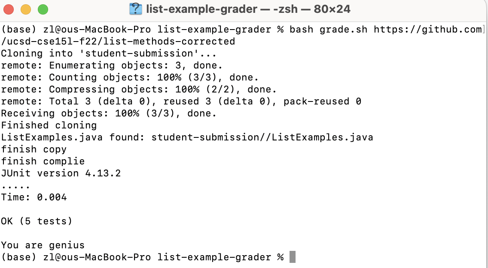
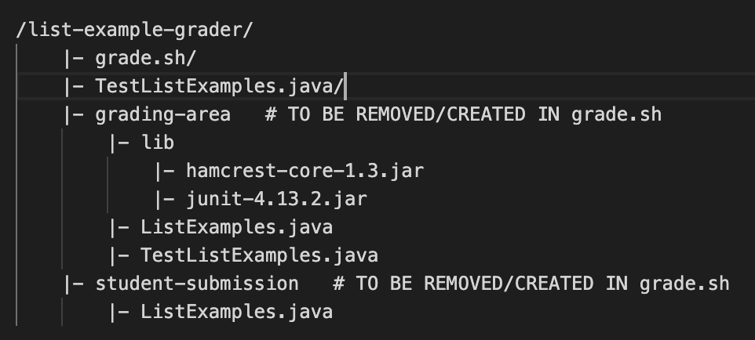

# Lab Report 5
## Zelong Wang

### Step 1: Student Screenshot and Symptom

Hi TAs, here is my bash code for `grade.sh`. I tested it with the link of correct repository, but the grader says failed. Looking at the terminal, I think the problem should be the file is not found? But based on the given instruction, the file should be there. Below is the terminal output: 

### Step 2: Suggestion from a TA

Try to print out the value stored in `file_found` on line 19 using `echo`. 

And also check this [post](https://unix.stackexchange.com/a/447244) about how bash works with different kinds of strings. 

In your case of setting up the conditions, it might be helpful to take a look at the meaning and uage of `-z` [here](https://stackoverflow.com/a/18096739)

### Step 3: Student Update and What the Bug is.
Thanks for your help!
I tried to print out the value stored in `file_found`. And find it is the path string.

And by reading the first post, I know Bash variables don't have types, so there's no such thing as a boolean variable or value like true or false. Basically all bash variables are just strings.
When I test a variable/string in bash without specifying the type of test (`-n` or `-z`), it will default to a -n (nonzero length string) test. As long as `$var` contains at least 1 character, it was evaluate to true. So that's why `"file not found"` condition was triggered. 

By looking at the second post, I know that `-z` string: True if the string is null (an empty string) is the opposite of my previous condition so now the condition is appropriately triggered.

I modified the code by putting `-z` before `"$file_found"` (line 22).

Now I got correct output:

### Step 4.1: The file & directory structure needed

### Step 4.2: The contents of each file before fixing the bug
[Files Link](https://github.com/zew013/cse15l-lab-reports/tree/main/lab-rep5/list-example-grader)

### Step 4.3: The full command line (or lines) you ran to trigger the bug
`(base) zl@ous-MacBook-Pro list-example-grader % bash grade.sh https://github.com/ucsd-cse15l-f22/list-methods-corrected`

### Step 4.4: A description of what to edit to fix the bug
add `-z` before `"$file_found"` at `grade.sh` line 22.

        

