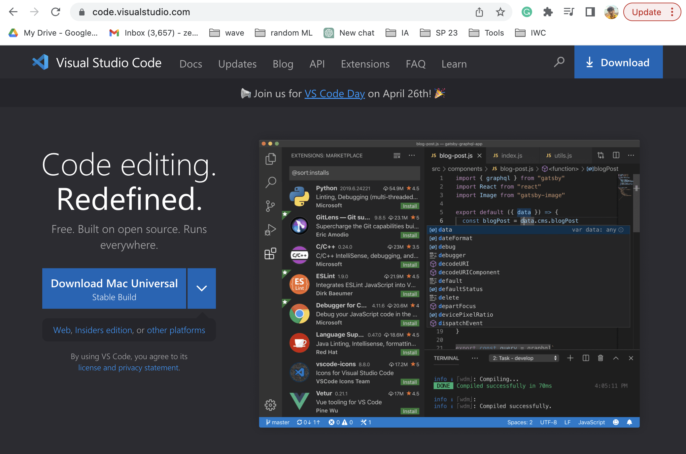
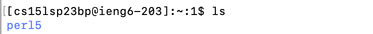
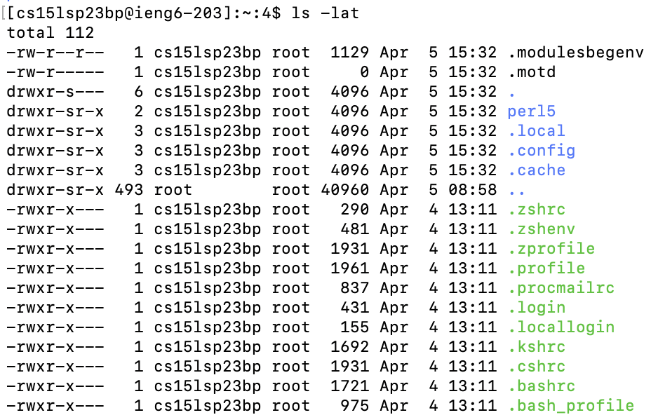
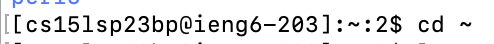
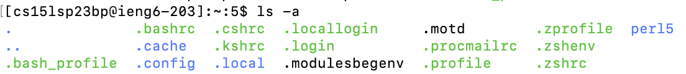
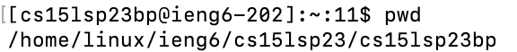
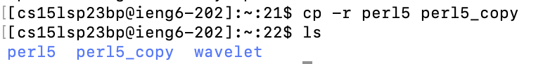

# Lab Report 1
## Zelong Wang

### Part 3 - Visual Studio Code


I installed and used VS Code for other classes. So it’s already installed. Generally, you just search vscode on Google, go to their [website](https://code.visualstudio.com/) and select the one that match your operating system.

Here is an example of download page for Mac



### Part 4 - Remotely Connecting
I am more familiar with the Terminal on Mac. So I used the Terminal on Mac. \
After typing

```ssh cs15lsp23bp@ieng6.ucsd.edu```

You need to modify ```cs15lsp23bp``` with your own username.

and entered your password as shown below:


Notice you will not be able to see the password when typing, just hit enter or return after typing your password. Then if things work correctly, you will see the welcome page as below.

### Part 5 – Run Some Commands
Then I tried various commands in the remote server and did similar things on my own laptop with different file names:

1. I tried ```ls``` to see what files are available. 



2. I also check any hidden files, their permission and other info using ```ls -lat```



3. I double check whether I am in the home directory using ```cd ~```



4. Then I list the hidden files again using ```ls -a```



5. Check the absolute path beyond home directory using ```pwd```



6. Then I copied the file ```perl5``` using ```cp -r```. ```-r``` here is recursively copy.




### Part 6 – git, Github, and Github Pages and Part 7 – Creating a Website with Github Pages
[Link to github page](https://zew013.github.io/cse15l-lab-reports/)
