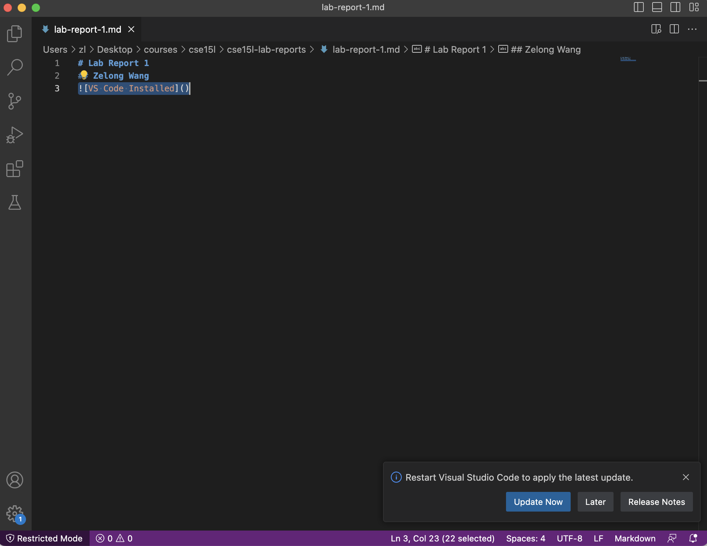
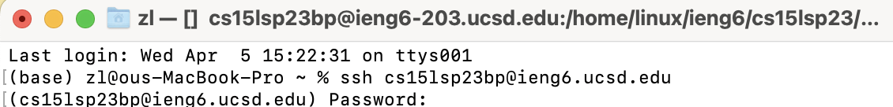
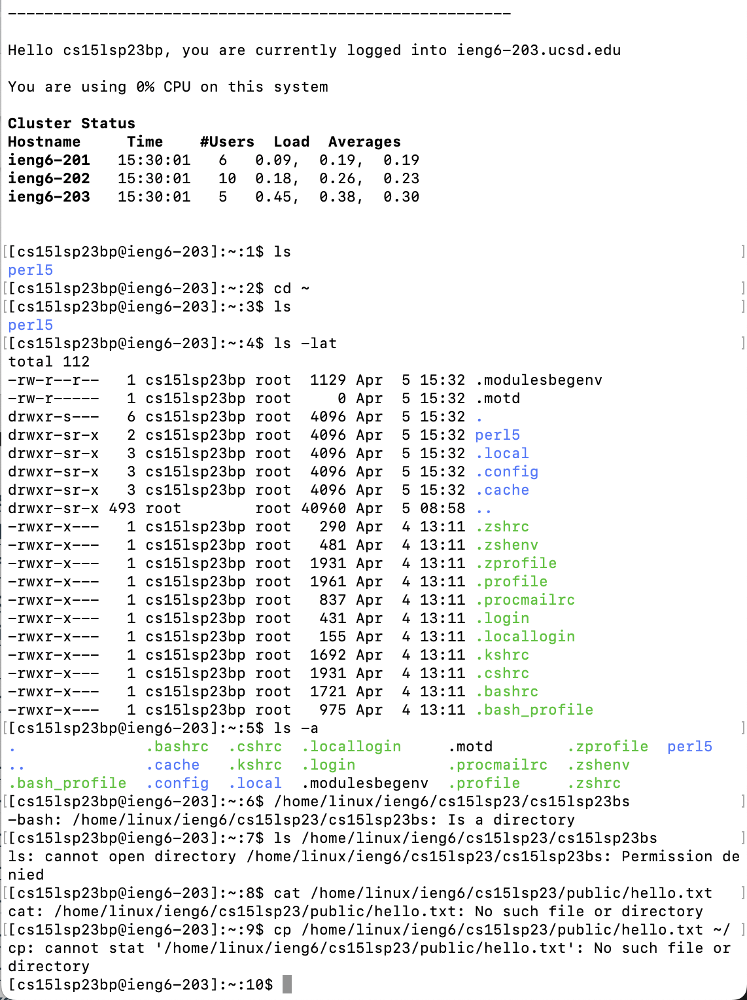

# Lab Report 1
## Zelong Wang

### Part 3 - Visual Studio Code

I installed and used VS Code for other classes. So it’s already installed. Generally, you just search vscode on Google, go to their [website](https://code.visualstudio.com/) and select the one that match your operating system.

### Part 4 - Remotely Connecting
I am more familiar with the Terminal on Mac. So I used the Terminal on Mac. \
After typing 
> ssh cs15lsp23bp@ieng6.ucsd.edu \

and entered my password as shown below:

### Part 5 – Run Some Commands
Then I tried various commands in the remote server and did similar things on my own laptop with different file names:

### Part 6 – git, Github, and Github Pages and Part 7 – Creating a Website with Github Pages
[Link to github page](https://zew013.github.io/cse15l-lab-reports/)
