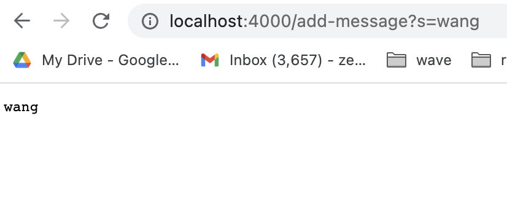
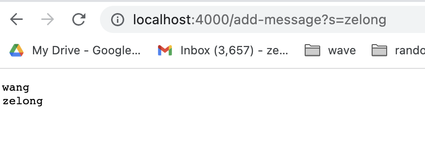

# Lab Report 2
## Zelong Wang

### Part 1
Code of StringServer:
```
import java.io.IOException;
import java.net.URI;

class Handler implements URLHandler {
    String string = "";
    public String handleRequest(URI url) {
        if (url.getPath().equals("/")) {
            return string;
        } 
        else {
            System.out.println("Path: " + url.getPath());
            if (url.getPath().contains("/add-message")) {
                String[] parameters = url.getQuery().split("=");
                if (parameters[0].equals("s")) {
                    string += parameters[1] + '\n';
                    return string;
                }
            }
        }
        return "404 Not Found!";
    }
}

class StringServer {
    public static void main(String[] args) throws IOException {
        if(args.length == 0){
            System.out.println("Missing port number! Try any number between 1024 to 49151");
            return;
        }

        int port = Integer.parseInt(args[0]);

        Server.start(port, new Handler());
    }
}
```


This is the main page of StringServer.

StringServer was called and started a new port. At the same time, a new Handler was created with string initialized as an empty ```string```. The argument now is just the url. And since there's no other argument after this, the first condition in ```handleRequest``` was triggered thus return the current string which is empty.



This is the page when calling ```/add-message``` the first time.

 Handler was called again. The argument now is still the url but it includes a query with the message to be added. The second condition is triggered and the ```add-message``` path is recognized. Then query part of the url is extracted. ```parameters``` is created to record the query. ```parameters[0]``` is the content before "=" and ```parameters[1]``` is the content after "=". If ```parameters[0]``` equals "s", then ```parameters[1]``` is added to the ```string```



This is the page when calling ```/add-message``` the second time.

Handler was called again. The argument is the url with the same struture when we first added message. Simialr to the steps in the first time, query is extracted and new message is stored in ```parameters``` and get added to ```string```, except this time ```string``` already contains the message from last time.


### Part 4 - Remotely Connecting
I am more familiar with the Terminal on Mac. So I used the Terminal on Mac. \
After typing 
> ssh cs15lsp23bp@ieng6.ucsd.edu

and entered my password as shown below:


### Part 5 – Run Some Commands
Then I tried various commands in the remote server and did similar things on my own laptop with different file names:


### Part 6 – git, Github, and Github Pages and Part 7 – Creating a Website with Github Pages
[Link to github page](https://zew013.github.io/cse15l-lab-reports/)
