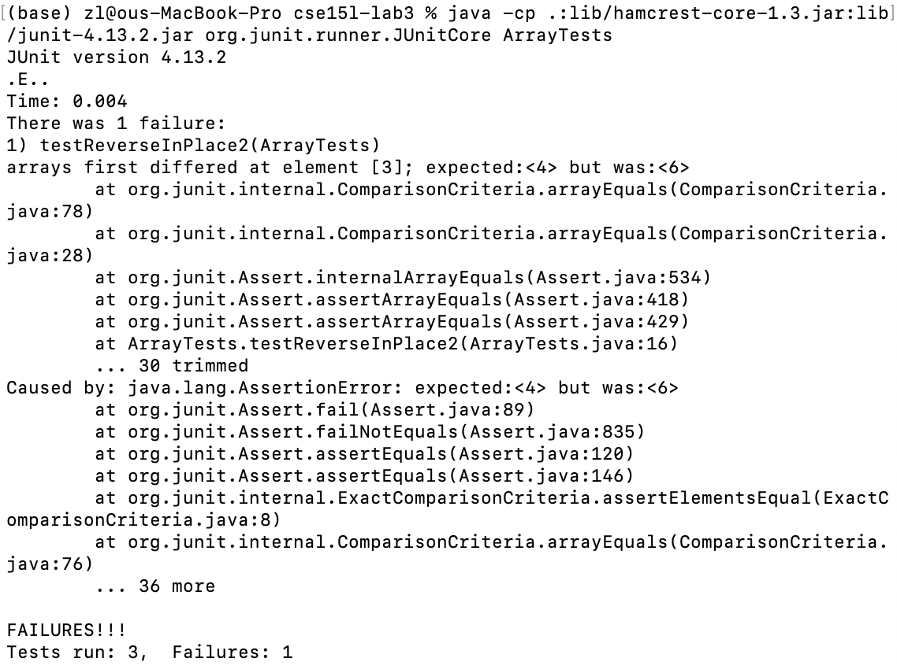

# Lab Report 2
## Zelong Wang

### Part 1
Code of StringServer:
```
import java.io.IOException;
import java.net.URI;

class Handler implements URLHandler {
    String string = "";
    public String handleRequest(URI url) {
        if (url.getPath().equals("/")) {
            return string;
        } 
        else {
            System.out.println("Path: " + url.getPath());
            if (url.getPath().contains("/add-message")) {
                String[] parameters = url.getQuery().split("=");
                if (parameters[0].equals("s")) {
                    string += parameters[1] + '\n';
                    return string;
                }
            }
        }
        return "404 Not Found!";
    }
}

class StringServer {
    public static void main(String[] args) throws IOException {
        if(args.length == 0){
            System.out.println("Missing port number! Try any number between 1024 to 49151");
            return;
        }

        int port = Integer.parseInt(args[0]);

        Server.start(port, new Handler());
    }
}
```


This is the main page of StringServer.

StringServer was called and started a new port. At the same time, a new Handler was created with string initialized as an empty ```string```. The argument now is just the url. And since there's no other argument after this, the first condition in ```handleRequest``` was triggered thus return the current string which is empty.


This is the page when calling ```/add-message``` the first time.

 Handler was called again. The argument now is still the url but it includes a query with the message to be added. The second condition is triggered and the ```add-message``` path is recognized. Then query part of the url is extracted. ```parameters``` is created to record the query. ```parameters[0]``` is the content before "=" and ```parameters[1]``` is the content after "=". If ```parameters[0]``` equals "s", then ```parameters[1]``` is added to the ```string```


This is the page when calling ```/add-message``` the second time.

Handler was called again. The argument is the url with the same struture when we first added message. Simialr to the steps in the first time, query is extracted and new message is stored in ```parameters``` and get added to ```string```, except this time ```string``` already contains the message from last time.


### Part 2
The bug I am choosing is the ```reverseInPlace``` method from ```ArrayExamples.java```.

The original method is like this:
```
static void reverseInPlace(int[] arr) {
    for(int i = 0; i < arr.length; i += 1) {
      arr[i] = arr[arr.length - i - 1];
    }
  }
```
import library for Junit:
```
import static org.junit.Assert.*;
import org.junit.*;
```
1. Failure-inducing input: 
```
public class ArrayTests {
    @Test 
	public void testReverseInPlace2() {
        int[] input1 = { 3, 4, 5, 6, 7 };
        ArrayExamples.reverseInPlace(input1);
        System.out.print(input1);
        assertArrayEquals(new int[]{ 7,6,5,4,3 }, input1);
	}
}
```
2. An input that doesn’t induce a failure
```
public class ArrayTests {
	@Test 
	public void testReverseInPlace() {
        int[] input1 = { 3 };
        ArrayExamples.reverseInPlace(input1);
        assertArrayEquals(new int[]{ 3 }, input1);
	}
}
```

3. The symptom of 1 and 2. We can see we want the array to be reversed from ```{ 3, 4, 5, 6, 7 }``` to ```{ 7,6,5,4,3 }``` but failed at position 3. The symptom is 6 instead of what we expected 4. However, we passed the case of ```{ 3 }``` and didn't fail the Junit.



4. The bug exist in ```arr[i] = arr[arr.length - i - 1];``` as we are modifying the first half part in ```arr[i] = ```. By the time we reached the first half part in ```arr[arr.length - i - 1];```, we have lost track of the original array.

Fixed code: 
```
static void reverseInPlace_fix(int[] arr) {
    int n = arr.length;
    for (int i = 0; i < n / 2; i++) {
        int temp = arr[i];
        arr[i] = arr[n - 1 - i];
        arr[n - 1 - i] = temp;
    }
}
```
It fixed the issue because we never reach the second half part. The swap was achieved by only tracking the half of the index.


### Part 3
I didn't know how to perform many command line operation like copy and get path. By practicing these operations many times, I am more comfortable doing this. I also didn't know the similarities shared between markdown and html. I thought we can only use `````` in markdown. But when I tried to resize the image, I realized the image, I realized we could also use ``````.
And I learned java almost 2 years ago and was forgetting most of it. It's nice to review.